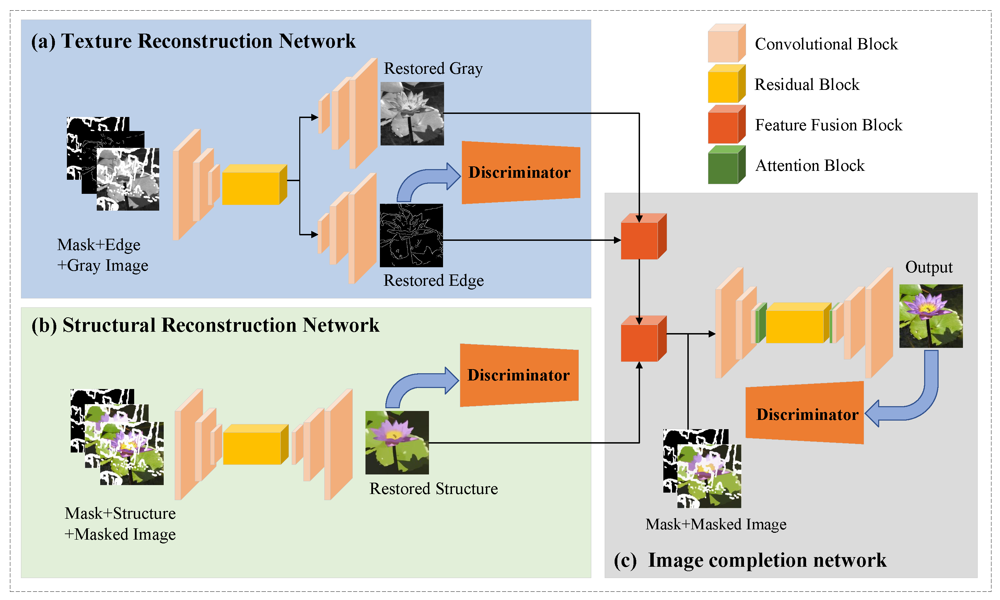

## STNet: Structure and Texture-guided Network for image inpainting

by Zhan Li1, Yanan Zhang, Yingfei Du, Yongqin Zhang, Xiaofeng Wang, Chao Wen, Fan Jia, Guohua Geng, Hai Zhang

* **SAIL (Statistic Analysis And Intelligent Learning) Lab of NWU**

* We provide related codes and configuration files to reproduce the "STNet: Structure and Texture-guided Network for image inpainting"

## Introduction
Our paper proposes a novel deep learning model STNet to restore the damaged images, which can be considered as a combination of the extension of image decomposition and the inverse process of it.

<div align="center">
  
</div>


## Citation
```

```

## Train
Enter python train.py to run the code. If you are prompted for no packages, enter pip install * * to install dependent packages

## Inference
After training, you can use the python test.py to validate your model.

